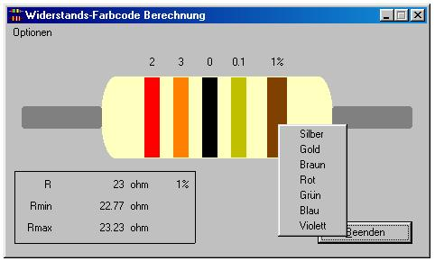



## electronic Tool

### Description

Berechnet den Wert von elektrischen Widerständen und Drosseln aus dem Farbcode.

Das Programm zeigt wie man popup menus verwendet und andere Sachen.

This program calculates the value of electronic Resistors from the color code.

You can learn about popup menus and other things
 
### More Info
 

             |
---                |---
**Submitted On**   |2000-04-30 13:06:56
**By**             |[amaru](https://github.com/Planet-Source-Code/PSCIndex/blob/master/ByAuthor/amaru.md)
**Level**          |Intermediate
**User Rating**    |5.0 (15 globes from 3 users)
**Compatibility**  |VB 5\.0, VB 6\.0
**Category**       |[Complete Applications](https://github.com/Planet-Source-Code/PSCIndex/blob/master/ByCategory/complete-applications__1-27.md)
**World**          |[Visual Basic](https://github.com/Planet-Source-Code/PSCIndex/blob/master/ByWorld/visual-basic.md)
**Archive File**   |[CODE\_UPLOAD53524302000\.zip](https://github.com/Planet-Source-Code/amaru-electronic-tool__1-7655/archive/master.zip)

